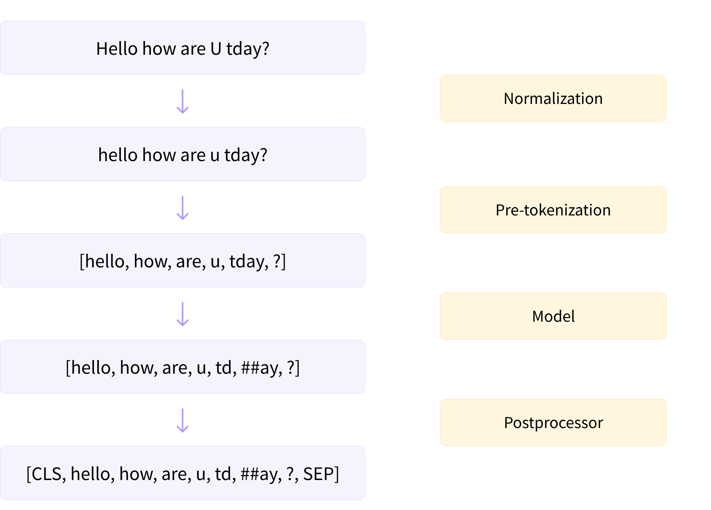

## 为什么需要Tokenizer
1. 语言模型的训练和推理阶段都需要将用户输入的句子切分为token序列
2. 神经网络只接受数值类型，需要一个组建完成从字符串到熟知的转化
## Tokenizer处理流水线

1. Normalization正则化  
   去除多余的换行和空格，大小写转化等处理。
2. Pre-tokenization预分词  
   基于空格/标点/规则进行分词，去掉停用词
3. Model基于模型的分词流程  
   BPE，WordPiece等
4. Post-processor后处理  
   特殊的分词逻辑，例如添加special token
## Tokenizer分词的Level
1. Word-Level  
   faster -> faster
2. Subword-Level  
   faster -> fast+er
3. Char-Level  
   faster -> f+a+s+t+e+r

词表大小：Word>Subword>Char
> OOV(Out Of Vocab) -> [UNK]

## 常见分词器
### SentencePiece
Char-Level, Word-Level, BPE/BBPE, Unigram
### *Subword Tokenizers
BPE/BBPE, Unigram, WordPiece

## 实验-BPE方法
1. 准备语料库，确定期望的subword词表大小等参数
2. 在每个单词末尾添加前缀或者后缀标记单词的边界，并统计每个单词出现的频率。解决ab->[a1,a2,b1,b2]在复原时是[a1,a2][b1,b2]还是[a1][a2,b1][b2]的问题。
3. 将语料库中所有单词拆分为单个字符，用所有单个字符建立最初的词典
4. 统计每个字符的频率，挑出频次最高的符号对，比如t和h组成的th，将新字符加入词表
5. 然后将预料中所有该字符对融合(merge)，即所有的t和h都变成th
6. 重复4-5操作，直到词表中单词数达到设定量/最高符号对的频数为1，退出合并流程

## 如何支持多语言？如中文
躺平了卷  
char(unicode) -> 36538 24179 20102 21367  
Bytes(utf-8)  -> e8_ba_ba e5_b9_b3 e4_ba_86 e5_8d_b7  
任务：在字符级别，对句子中的word进行拆分/重组，得到tokens